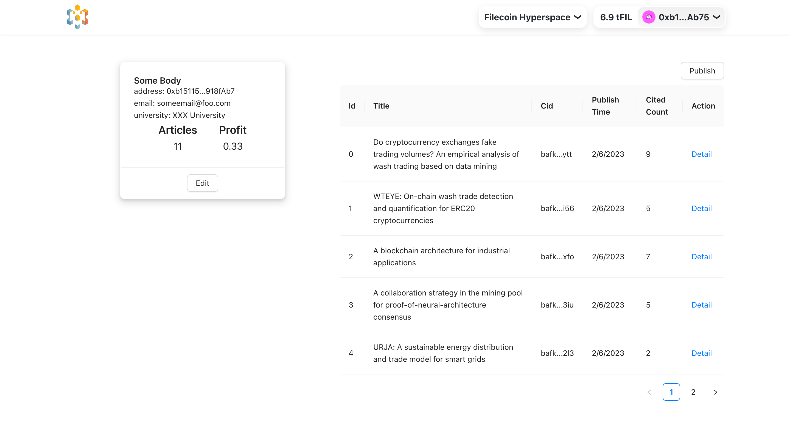
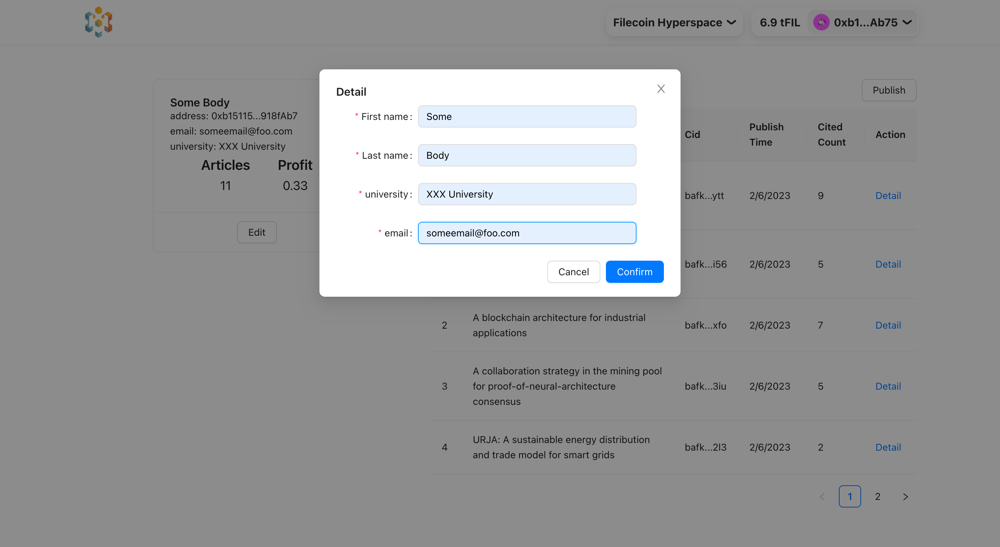
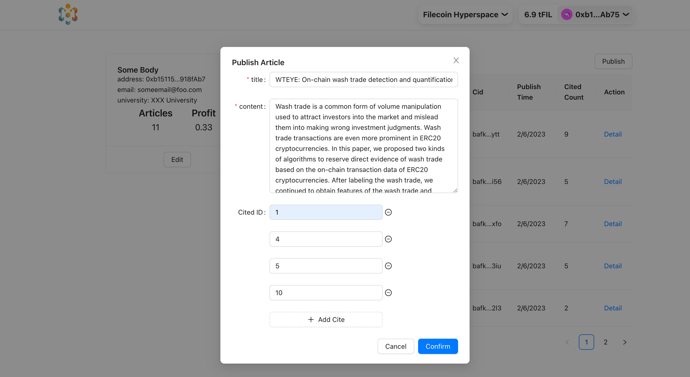

# DOAAD

Keywords: FIL, IPFS, DeSci, Academic, Paper.

Smart Contract for DOAAD: <https://github.com/lxdao-official/DOAAD-contract/>

DOAAD (Decentralized Open Access Article Database) is a set of decentralized applications dedicated to **reconstructing the current academic paper publishing process**. It not only allows your papers to be permanently stored, but also allows you to directly obtain economic rewards from the papers you create . DOAAD can help you do the following:

1. Search papers.
2. Read the paper.
3. Publish papers and pay royalties for cited papers.
4. Receive token rewards when papers are cited by other paper creators.

**DOAAD provided a brand new way to keep and maintain human knowledge, making them: Open, Free to access, sustainable, and decentralized.**

## Background

In the current process of publishing papers, **authors of papers need to pay huge page fees to publishers** (Elsevier: $200 and $10,100 US Dollars), and **readers also need to pay high fees to read the papers**. Among them, **the biggest beneficiaries are the publishers**, not the hard-working researchers. No penny of the fees paid by readers flows into the hands of the authors, and **the publishers block the channels that motivate researchers to create more valuable papers**.

Furthermore, researchers can only obtain the recognition of universities/institutions/enterprises by publishing their papers in journals with high impact factors, and then obtain more income and higher positions, so that the value of the paper itself is underestimated, and **more and more researchers have to produce some low-quality papers for publication in order to make a living**.

In summary, **our team believes that the current paper publication process greatly hinders the dissemination of knowledge and the development of science**. The good news is that with the development of blockchain in recent years, the improvement of smart contracts, the application of IPFS, and decentralized peer review The proposal of the mechanism has given us new hope! For those reasons, we designed DOAAD and plan to gradually improve it in the coming year.

## How does it work?

The process of incomplete MVP for the FVM Hackathon is super simple:

- Authors can create an academic profile on DOAAD
- Authors can search and cite papers on DOAAD. When creating the paper, they need to pay $FIL for the paper uploading. They need to pay more if they cite more papers
- The $FIL will be used for keeping papers on IPFS, and part of them will flow to the Authors (including cited Authors)
- Readers can search and read the papers on DOAAD. Also, they can make donations to the paper they like for maintaining paper on IPFS and supporting the Authors

Our innovation for the new paper publishing system is the sustainability cycle:

As we mentioned in the diagrams, this will be a very important workflow for selecting and maintaining valuable papers. Valuable papers will last longer, and the authors will receive more tokens, this strategy will encourage researchers to focus on their domain and create valuable papers.

**For the record, we haven't finished the donation feature due to limited time. Also, we only support paying $FIL to just your upstream cited papers for now.**

## Screenshots for MVP

### Index

Enter the title to search the article you want to read.

### Article Detail

You can see article title, content and cited articles here, if you want to cite this article please remember its id which will be used when publish.

### Article List

Here you can edit your profile, publish your articles, view your article list, and how much profit you have made.

### Edit profile

### Publish Article

## Roadmap

For now, this is an incomplete MVP for FVM Hackathon. This is just the beginning, we have a longer plans for this project.

### Q1

Further research on users, determine target users, identify user needs, and ensure the focus of future development plans.

Improve the storage fields of papers in DAPP to make it closer to the structure of papers in reality, such as: author, abstract, keywords, etc. Add file upload function to reduce user difficulty.

### Q2

Redesign the UI, improve the article retrieval function, and finally achieve the same search speed as traditional databases.

Design a ZK-based user DID subsystem to protect user privacy while realizing the correspondence between the author's off-chain identity and on-chain identity, providing authors with more off-chain value and increasing the user's cost of doing evil.

### Q3

Connect to the decentralized peer review system, design a peer review reward mechanism, and improve the quality of papers published in DOAAD.

### Q4

Design the reward mechanism for early users, recruit university promotion ambassadors, seek cooperative organizations, and expand social influence and popularity.

## Team

TODO add more info and links like github, twitter, etc

- [0xhardman](https://github.com/): LXDAO builder, striving to become a full-stack web3 developer, Loving to try something new. Twiter:[@fuckingsafari](https://twitter.com/fuckingsafari)
- ArvinZhong
- Lidamao
- [BruceXu](https://github.com/brucexu-eth): LXDAO Core buidler, FullStack Developer, Presenter, and test tokens provider :). Twitter: [@brucexu_eth](https://twitter.com/brucexu_eth)
- Noy

Most of the teammates came from [LXDAO](https://lxdao.io/). LXDAO is an R&D-focused DAO in Web3, and got Filecoin grants before for contributing IPFS ecosystem.
